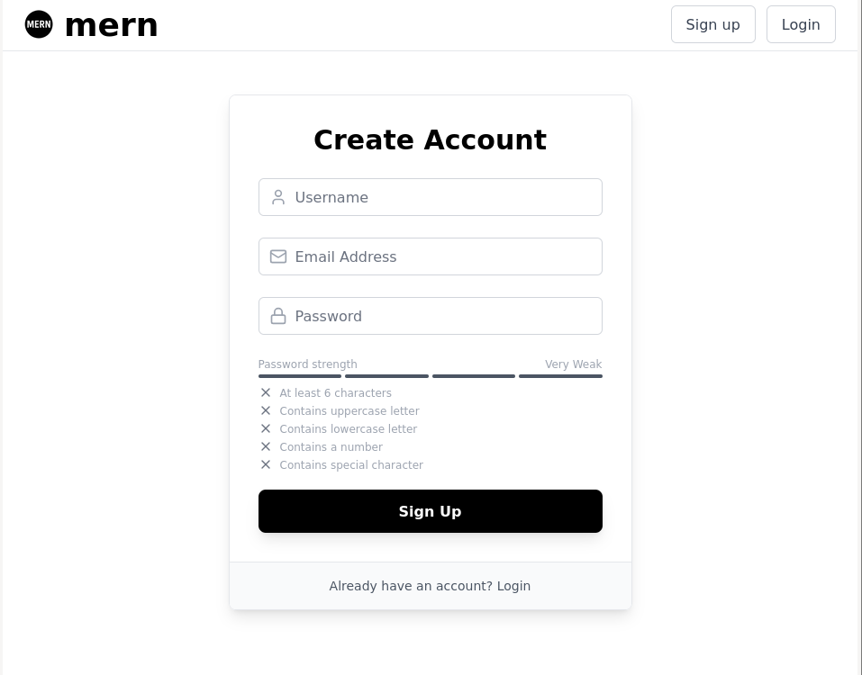

# mern
This is an example MERN full stack application with basic authentication features such as secure login/logout, password resets and email verification. Feel free to use it as boilerplate code for your own projects.

## Screenshot



## Prerequisites

- Node.js
- MongoDB

## Setup

1. Go to the root directory:
```bash
cd mern
```

2. Setup .env file:
```bash
echo "NODE_ENV=development" > .env
echo "SERVER_HOST=localhost" >> .env
echo "SERVER_PORT=3000" >> .env
echo "CLIENT_HOST=localhost" >> .env
echo "CLIENT_PORT=5173" >> .env
echo "DATABASE_HOST=localhost" >> .env
echo "DATABASE_PORT=27017" >> .env
echo "DATABASE_USER=admin" >> .env
echo "DATABASE_PASSWORD=" >> .env
echo "DATABASE_NAME=mern" >> .env
echo "JWT_SECRET=secret-key" >> .env
```

3. Install dependencies:
```bash
npm install
```

4. Start the app:
```bash
npm run start
```

## Database
To clear the database of all data:
```bash
cd backend
npm run reset
```
